<div align="center">

# pneumovit-explain — Pneumonia Detection With Honest Explanations

**pneumovit-explain is a chest X-ray pneumonia classifier with explanations that do not depend on its own prediction. It takes an X-ray folder through these steps to a calibrated flag and an evidence summary:**

`patient split` → `train` → `select and calibrate on val` → `one test pass` → `neighbours + saliency` → `checked summary`.


**[Summary](#1-summary)** ·
**[Workflow](#4-the-end-to-end-workflow)** ·
**[Run it](#10-how-to-run-pneumovit-explain)** ·
**[Configuration](#104-environment-variables)** ·
**[Known problems](#13-known-problems)** ·
**[Glossary](#15-glossary)**

</div>

> [!NOTE]
> This README uses ASD-STE100 Simplified Technical English. The writing rules and the project
> vocabulary are in [`docs/ste-style-guide.md`](docs/ste-style-guide.md). Each term in the
> [Glossary](#15-glossary) has only one meaning.

---

pneumovit-explain classifies pediatric chest X-rays as NORMAL or PNEUMONIA and shows the evidence. The main idea is evidence that can disagree with the model. The neighbours come from training images of both classes, the saliency map passes a randomisation check, and the language model never receives the predicted label.

This README is the **one location that explains all of pneumovit-explain**. It gives these topics:

- the general design
- each component and its procedure, step by step
- the decision rules
- the data map
- the runbook
- the validation results and the known problems

| If you are… | Read |
|---|---|
| A manager or reviewer | [1](#1-summary), [3](#3-design-rules), [4](#4-the-end-to-end-workflow), [12](#12-validation-results), [14](#14-key-points) |
| A developer who joins the project | All sections, in sequence. Keep [10](#10-how-to-run-pneumovit-explain) and [13](#13-known-problems) open while you work |
| An operator who runs pneumovit-explain | [10](#10-how-to-run-pneumovit-explain), then the section for the component that you use |

> [!WARNING]
> Do not use pneumovit-explain for a diagnosis. It is not a diagnostic device. A qualified clinician must make every clinical decision. The public dataset is pediatric and comes from one centre, so results do not transfer to adults or other sites.

---

## Table of contents

1. 🧭 [Summary](#1-summary)
2. 🏗️ [How pneumovit-explain is built](#2-how-pneumovit-explain-is-built)
   - 2.1 [Components](#21-components)
   - 2.2 [System context](#22-system-context)
   - 2.3 [Repository layout](#23-repository-layout)
3. 🛡️ [Design rules](#3-design-rules)
4. 🔄 [The end-to-end workflow](#4-the-end-to-end-workflow)
   - 4.1 [Full flow](#41-full-flow)
   - 4.2 [The life cycle of one image](#42-the-life-cycle-of-one-image)
   - 4.3 [Who does which step](#43-who-does-which-step)
5. 🔵 [The patient-aware split](#5-the-patient-aware-split)
6. 🟢 [The classifiers, calibration and the threshold](#6-the-classifiers-calibration-and-the-threshold)
7. 🟣 [The explanations](#7-the-explanations)
8. ⚖️ [The metrics and the safety rules](#8-the-metrics-and-the-safety-rules)
9. 🗂️ [Data and file map](#9-data-and-file-map)
10. ▶️ [How to run pneumovit-explain](#10-how-to-run-pneumovit-explain)
    - 10.1 [Prerequisites](#101-prerequisites) · 10.2 [Installation](#102-installation) · 10.3 [Run pneumovit-explain](#103-run-pneumovit-explain) · 10.4 [Environment variables](#104-environment-variables)
11. 🧩 [How to extend pneumovit-explain](#11-how-to-extend-pneumovit-explain)
12. ✅ [Validation results](#12-validation-results)
13. ⚠️ [Known problems](#13-known-problems)
14. 📌 [Key points](#14-key-points)
15. 📖 [Glossary](#15-glossary)
16. 📄 [License](#16-license)

---

## 1. Summary

**The problem.** The earlier prototype chose its best epoch on the test images and served a different checkpoint. It also asked a language model to justify the predicted class. These questions are difficult:

- Which images can choose the model, and which images can only measure it?
- How many pneumonia cases does the model miss at the chosen threshold?
- Does the evidence come from the image, or from the prediction itself?
- Can the summary text claim more than the numbers show?

pneumovit-explain gives each of these questions its own component. The patient-aware split separates choice from measurement, the threshold targets sensitivity, the explanations use independent evidence, and a checker rejects unsafe summary text.

| Item | Value |
|---|---|
| Input | The Kermany folder (`train`, `val`, `test` with `NORMAL` and `PNEUMONIA`), or synthetic images |
| Output | A bundle (`.joblib`), `report.md` and `results.json`, per-image JSON with neighbours, saliency zone and summary, overlay PNG |
| Components | **13** modules: config, dataset, synthetic, models, deep, metrics, pipeline, explain/knn, explain/saliency, explain/narrative, report, app, cli |
| Providers | Gemini or any OpenAI-compatible API for the summary (optional). A fake provider runs offline |
| Offline mode | All commands with the light classifier and the template summary |
| Safety | The test part is read once. The LLM gets facts, not the label, and no image by default. Every summary ends with the banner |
| Tests | **35** unit tests (`pytest`): 33 pass in CI, 2 skip without `torch` (all 35 pass with the `deep` extra) |

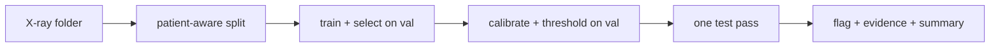

---

## 2. How pneumovit-explain is built

### 2.1 Components

| Component | Module | Purpose |
|---|---|---|
| Settings | `src/pneumovit_explain/config.py` | Read `PNEUMOVIT_*` variables and API keys from the environment. Keep keys out of `repr` |
| Index and split | `src/pneumovit_explain/dataset.py` | Scan the folder, read patient IDs, pool the official parts, split by patient |
| Generator | `src/pneumovit_explain/synthetic.py` | Synthetic X-ray-like images with focal or diffuse findings and known zones |
| Light classifier | `src/pneumovit_explain/models.py` | Handcrafted X-ray features, logistic regression, C chosen on val, lung zones |
| Deep classifiers | `src/pneumovit_explain/deep.py` | From-scratch ViT, timm backbones, class weights, cosine schedule, early stopping, rollout |
| Metrics | `src/pneumovit_explain/metrics.py` | AUC, sensitivity, specificity, PPV, NPV, Brier, ECE, temperature, threshold, patient bootstrap |
| Pipeline | `src/pneumovit_explain/pipeline.py` | Train and select, test pass, sanity check, zone agreement, bundle |
| Neighbour index | `src/pneumovit_explain/explain/knn.py` | Cosine search over train-part embeddings of both classes |
| Saliency | `src/pneumovit_explain/explain/saliency.py` | Blurred-patch occlusion, lung-zone scores, randomisation check, overlay |
| Summary | `src/pneumovit_explain/explain/narrative.py` | Facts, template, LLM adapters, text checker, banner |
| Report | `src/pneumovit_explain/report.py` | `report.md` and `results.json` |
| App | `src/pneumovit_explain/app.py` | Streamlit page with a cached bundle and in-memory uploads |
| CLI | `src/pneumovit_explain/cli.py` | The `pneumovit-explain` command with 7 subcommands |

The component map shows which module calls which module. An arrow points from the caller to the module that it uses.

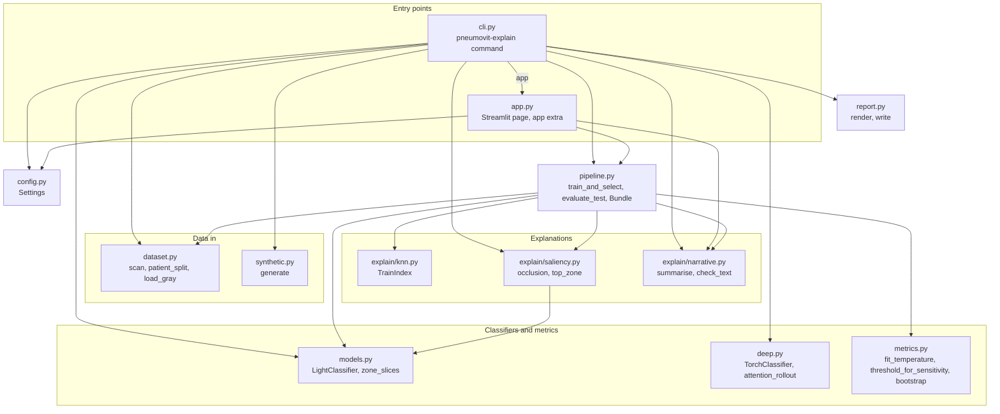

### 2.2 System context

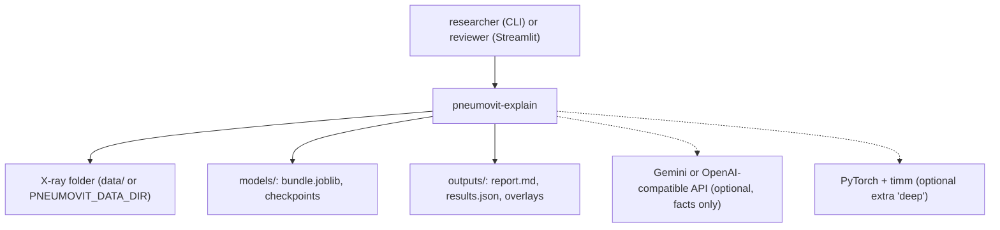

### 2.3 Repository layout

```
pneumovit-explain/
├── src/pneumovit_explain/  the package
│   └── explain/            knn.py, saliency.py, narrative.py
├── tests/                  35 pytest tests (2 need torch), synthetic images, fake LLM transports
├── data/README.md          dataset source, license, layout, patient IDs, privacy
├── docs/ste-style-guide.md writing rules and project vocabulary
├── .github/workflows/      ci.yml: pytest on Python 3.11 (no torch)
├── .env.example            names of the environment variables and API keys
└── pyproject.toml          package, extras deep / app / faiss, the entry point
```

---

## 3. Design rules

### 3.1 The val part chooses, the test part measures
`pipeline.train_and_select` reads only the train and val parts. It chooses the hyperparameters or the best epoch, fits the temperature and sets the threshold. A test records every image path that it reads and checks that no test-part image is among them.

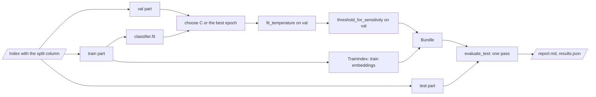

### 3.2 The served model is the selected model
`train_and_select` returns one bundle with the selected weights. `save_bundle` writes it, and the CLI and the app load that file. Deep training restores the best-validation weights before it saves the checkpoint.

### 3.3 Patients never cross a split
`dataset.parse_patient` reads the patient from the Kermany file name. `patient_split` pools the official parts and splits by patient, stratified by label. The official `val/` part has only 16 images, so the code does not use it as is.

### 3.4 The threshold targets sensitivity
A missed pneumonia is the important error. `metrics.threshold_for_sensitivity` chooses the highest threshold with val sensitivity at or above `PNEUMOVIT_TARGET_SENSITIVITY` (default 0.95). The report gives both this threshold and 0.5.

### 3.5 Evidence that can disagree
The neighbour index holds train-part images of both classes, and the query never filters by the prediction. The template says "do not agree" when most neighbours have the other label.

### 3.6 Saliency must depend on the model
The saliency map replaces each patch with a blurred copy and records the logit drop. The randomisation check compares the map with the map of a model fit on shuffled labels.

### 3.7 The summary uses facts only
The LLM receives the probability, the threshold, the neighbour counts and the strongest zone. It never receives the predicted label. The checker rejects text with certainty words or with numbers that are not in the facts. Then the template is used.

### 3.8 Private and portable by default
No image goes to an LLM unless `PNEUMOVIT_LLM_SEND_IMAGE=true`. The app keeps uploads in memory. `deep.pick_device` falls back to the CPU when CUDA is not available. API keys come from the environment only.

---

## 4. The end-to-end workflow

### 4.1 Full flow

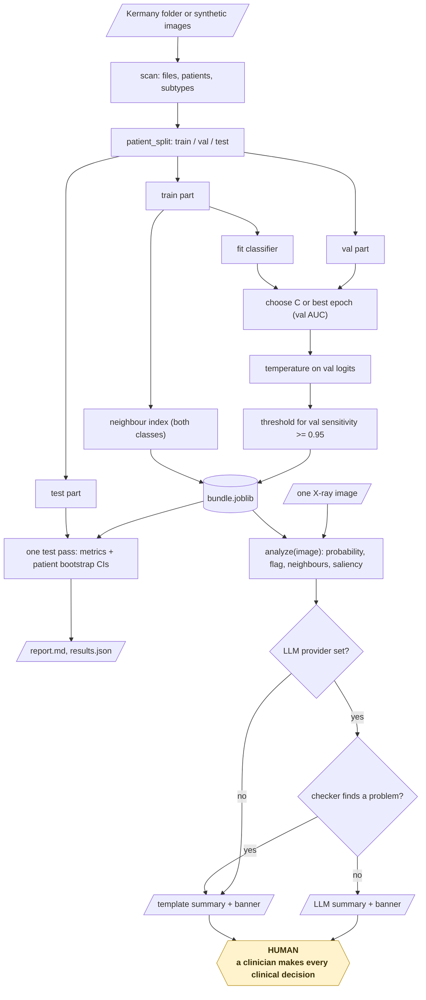

### 4.2 The life cycle of one image

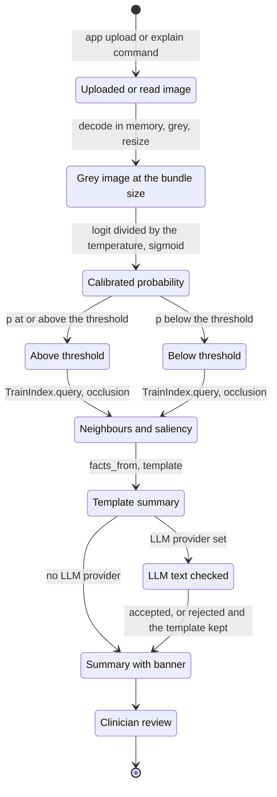

1. The app or the CLI decodes the image in memory and resizes it to the bundle size.
2. The classifier gives a logit. The temperature turns it into a calibrated probability.
3. The operating threshold gives the flag.
4. The classifier embeds the image. The index returns the 10 most similar train-part images with their labels.
5. The saliency map scores 225 blurred patches and names the strongest lung zone.
6. The template writes the summary from the facts. An optional LLM rewrites it, and the checker accepts or rejects the text.
7. The output ends with the banner. No file is written unless you ask for an overlay.

### 4.3 Who does which step

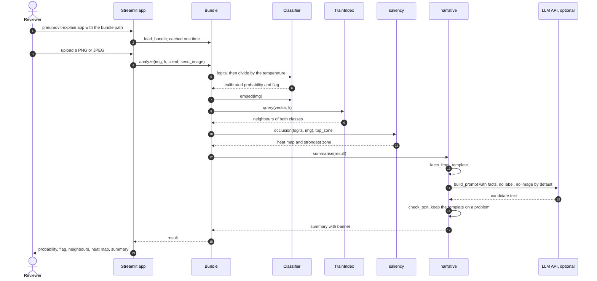

---

## 5. The patient-aware split

**Purpose.** Separate the images that choose the model from the images that measure it, with no patient in two parts.

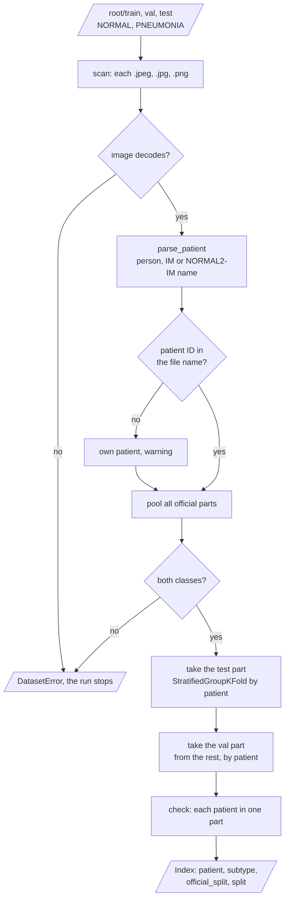

| Input | Output |
|---|---|
| The Kermany folder | An `Index` with `patient`, `subtype`, `official_split` and `split` for each image |

**Procedure**

1. Scan `train`, `val` and `test`, each with `NORMAL` and `PNEUMONIA`.
2. Read the patient and the subtype from each file name.
3. Pool all images.
4. Take the test part (`PNEUMOVIT_TEST_FRACTION`, default 0.2) by patient, stratified by label.
5. Take the val part (`PNEUMOVIT_VAL_FRACTION`, default 0.15) from the rest, by patient.

**Rules**

- A file that cannot be decoded stops the run.
- A file name without a patient ID becomes its own patient, with a warning.
- The scan warns when a patient appears in two official parts.

---

## 6. The classifiers, calibration and the threshold

**Purpose.** Fit a model, choose it on the val part, and turn its output into a calibrated probability and a flag.

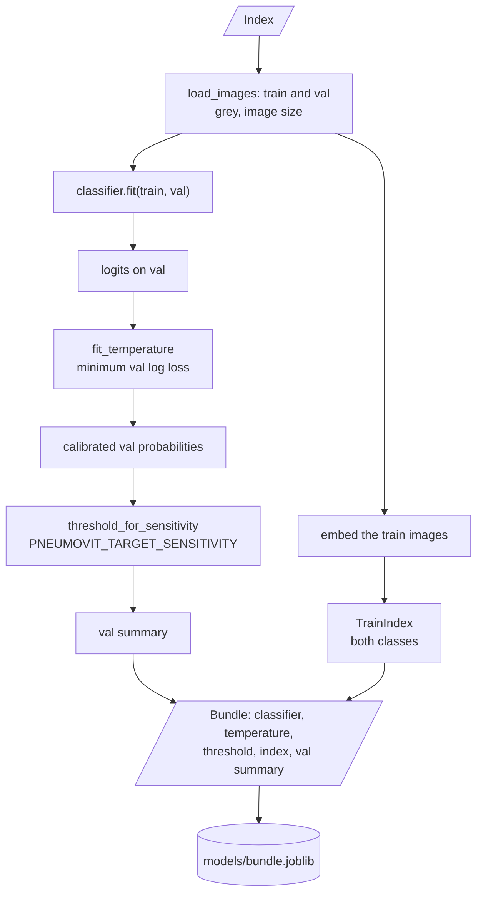

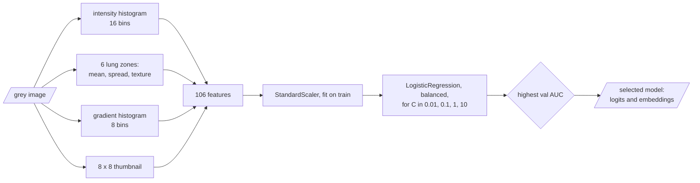

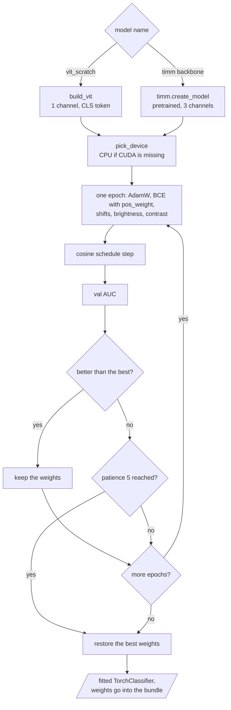

| Input | Output |
|---|---|
| Train and val images | A bundle: classifier, temperature, threshold, neighbour index, val summary |

**Procedure**

1. Fit the classifier on the train part with class weights.
2. Choose the hyperparameter (light) or the best epoch (deep) by val AUC.
3. Fit the temperature T on the val logits (minimum log loss).
4. Choose the threshold on the calibrated val probabilities for the target sensitivity.
5. Embed the train part and build the neighbour index.

| Model | Kind | Description |
|---|---|---|
| `light_logreg` | light | Logistic regression on 106 features: intensity histogram, 6 lung zones (mean, spread, texture), gradient histogram, 8 x 8 thumbnail. C from 0.01, 0.1, 1, 10 |
| `vit_scratch` | deep | Vision Transformer from random weights: patch embedding, CLS token, learned positions, pre-norm blocks. The ablation |
| `vit_small_dino` | deep | timm `vit_small_patch16_224.dino`, pretrained |
| `densenet121` | deep | timm `densenet121.tv_in1k`, pretrained |
| `convnext_tiny` | deep | timm `convnext_tiny.fb_in1k`, pretrained |

| Deep training rule | Value |
|---|---|
| Loss | BCE with `pos_weight` = negatives / positives |
| Optimiser | AdamW, learning rate 3e-4, weight decay 0.05 |
| Schedule | Cosine over the epoch count (default 30) |
| Early stopping | Val AUC, patience 5, best weights restored and saved |
| Augmentation | Small shifts, brightness and contrast. No flips, because left and right matter |

---

## 7. The explanations

**Purpose.** Show evidence for and against the flag that does not come from the flag itself.

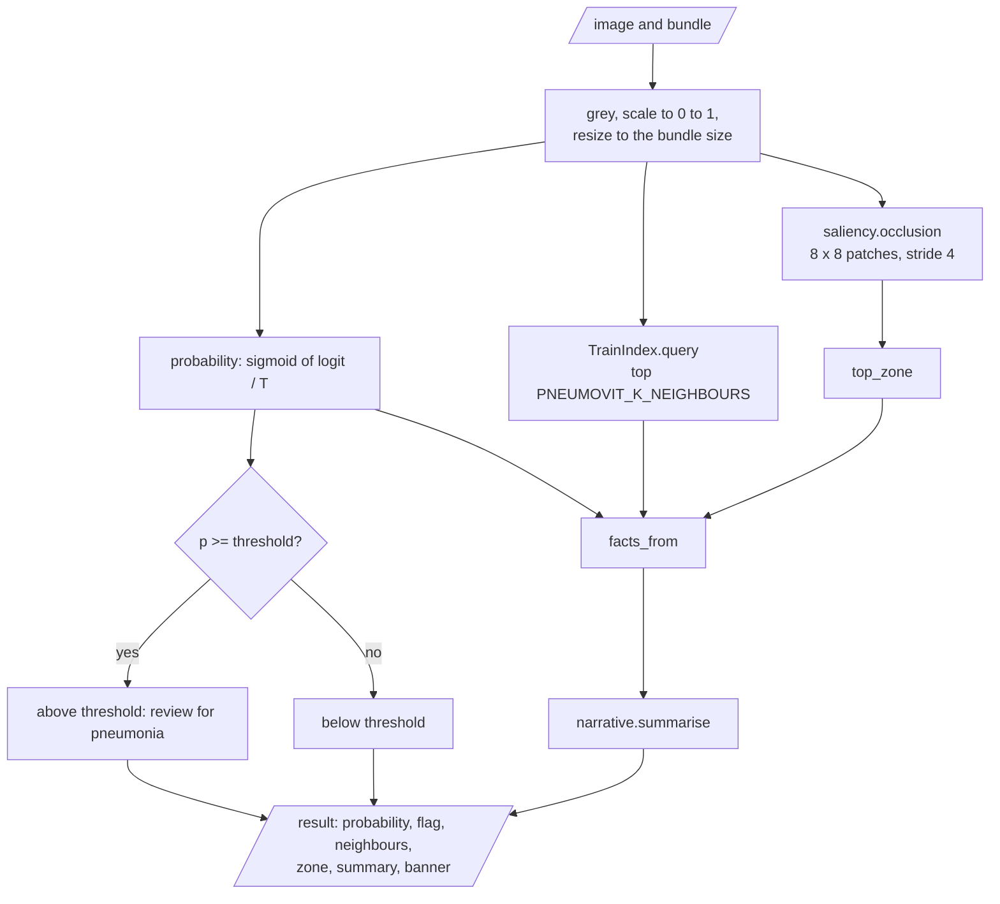

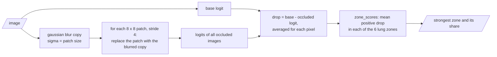

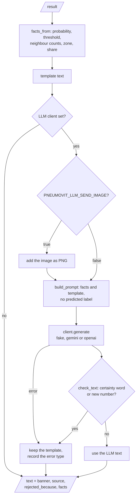

| Input | Output |
|---|---|
| One image and the bundle | Neighbours with labels, a saliency map, the strongest lung zone, a checked summary |

**Procedure**

1. Query the neighbour index with the image embedding. Return the top `PNEUMOVIT_K_NEIGHBOURS` (default 10) with labels.
2. Replace each 8 x 8 patch (stride 4) with a blurred copy and record the logit drop.
3. Calculate the mean positive drop in each of the six lung zones. Name the zone with the largest share.
4. Write the template summary from the facts.
5. If an LLM provider is set, send the facts and the template. Accept the answer only if the checker finds no problem.
6. Append the banner.

**Rules**

- For `vit_scratch`, `TorchClassifier.rollout` also gives attention rollout over all blocks, not only the first layer.
- The checker rejects certainty words such as "definitely", "confirms" and "diagnosis".
- The checker rejects every number that is not in the facts.
- An LLM error keeps the template and records the error type.

---

## 8. The metrics and the safety rules

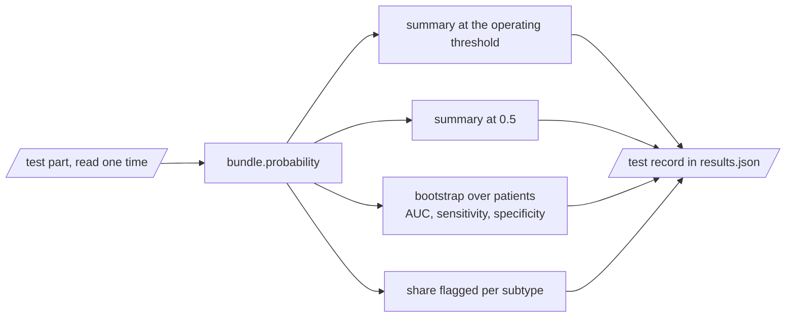

| Metric | Meaning |
|---|---|
| AUC | Ranking quality over all thresholds |
| Sensitivity | Share of pneumonia images that get the flag |
| Specificity | Share of normal images without the flag |
| PPV, NPV | Share of flagged images with pneumonia, share of unflagged images without it |
| Brier, ECE | Calibration of the probability |
| Share flagged per subtype | Flag rate for bacteria, virus and normal test images |
| Randomisation check | Spearman correlation of saliency maps: trained model vs. shuffled-label model |
| Zone agreement | Share of synthetic focal findings where the strongest zone is the true zone (chance 1/6) |

The two saliency checks run in `evaluate`:

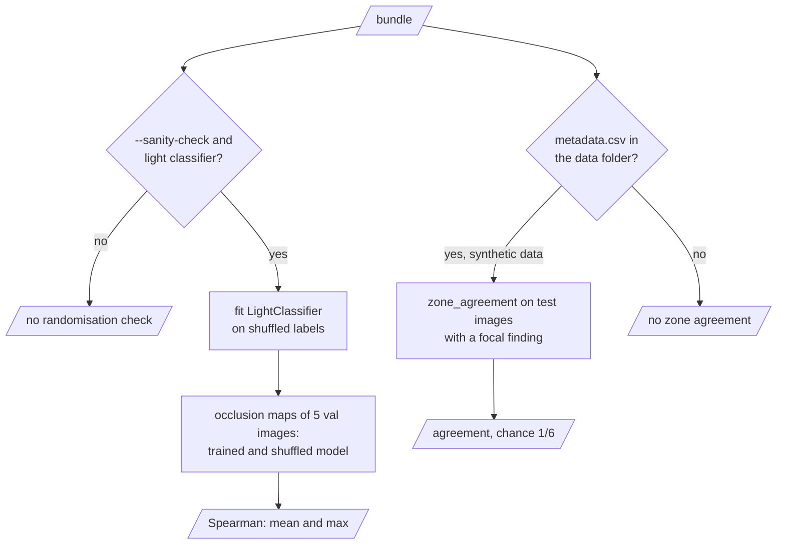

| Safety rule | Value in the code |
|---|---|
| Confidence interval | 95% percentile, bootstrap over patients, `PNEUMOVIT_BOOTSTRAP` resamples (default 1000) |
| Operating threshold | Highest threshold with val sensitivity >= `PNEUMOVIT_TARGET_SENSITIVITY` |
| LLM input | Facts only. No label. No image unless `PNEUMOVIT_LLM_SEND_IMAGE=true` |
| LLM output | Rejected on certainty words or new numbers |
| Banner | Appended to every summary and shown on top of the app |

---

## 9. Data and file map

| Path | Committed? | Contents |
|---|---|---|
| `data/README.md` | Yes | Source, license, layout, patient IDs, privacy |
| `data/chest_xray/**` | No (git ignores it) | X-ray images |
| `models/bundle.joblib` | No (git ignores it) | The selected classifier, temperature, threshold and neighbour index |
| `models/*.pt`, `models/*.json` | No (git ignores it) | Deep checkpoints with the best epoch. Only `TorchClassifier.save` writes them. The CLI keeps the deep weights in the bundle |
| `outputs/report.md`, `outputs/results.json` | No (git ignores it) | Evaluation results |
| `outputs/*.png` | No (git ignores it) | Saliency overlays |
| `.env` | No (git ignores it) | Local settings and API keys |

---

## 10. How to run pneumovit-explain

### 10.1 Prerequisites

| Need | For |
|---|---|
| Python 3.11+ | All components |
| PyTorch and timm (`pip install -e ".[deep]"`) | Only the deep classifiers and attention rollout |
| Streamlit (`pip install -e ".[app]"`) | Only the app |
| `GOOGLE_API_KEY` or `OPENAI_API_KEY` | Only an LLM summary |
| A Kaggle account | Only the public dataset (see [`data/README.md`](data/README.md)) |

### 10.2 Installation

```bash
git clone https://github.com/KrishnaAnnavaram/pneumovit-explain.git
cd pneumovit-explain
python -m venv .venv
. .venv/bin/activate            # Windows: .venv\Scripts\activate
pip install -e ".[dev]"         # add ",deep,app" for PyTorch, timm and Streamlit
```

### 10.3 Run pneumovit-explain

```bash
# offline demo: 300 synthetic patients, light classifier, report, sanity check, bundle
pneumovit-explain demo --workdir outputs/demo

# the public dataset (download it first, see data/README.md)
pneumovit-explain index --data-dir data/chest_xray --out outputs/split.csv
pneumovit-explain train --data-dir data/chest_xray --out models/bundle.joblib
pneumovit-explain evaluate --data-dir data/chest_xray --bundle models/bundle.joblib --sanity-check --out outputs/light

# deep classifiers (extra 'deep'): pretrained backbone, and the from-scratch ViT ablation
pneumovit-explain evaluate --data-dir data/chest_xray --model vit_small_dino --save-bundle models/dino.joblib --out outputs/dino
pneumovit-explain evaluate --data-dir data/chest_xray --model vit_scratch --image-size 224 --out outputs/vit_scratch

# one image, then the app
pneumovit-explain explain --bundle models/bundle.joblib --image path/to/xray.jpeg --overlay outputs/xray.png
pneumovit-explain app --bundle models/bundle.joblib

pytest -q
```

| Command | What it does |
|---|---|
| `pneumovit-explain demo` | Writes synthetic images and runs `evaluate` with the light classifier and the sanity check |
| `pneumovit-explain synth` | Writes synthetic images and `metadata.csv` (`--patients`, `--size`, `--pneumonia-share`) |
| `pneumovit-explain index` | Prints the patient-aware split, writes it with `--out` |
| `pneumovit-explain train` | Fits, selects and calibrates on train and val, saves the bundle |
| `pneumovit-explain evaluate` | One test pass with CIs. Trains first unless `--bundle` is given. `--sanity-check` adds the randomisation test |
| `pneumovit-explain explain` | Prints the JSON result for one image, writes an overlay with `--overlay` |
| `pneumovit-explain app` | Starts the Streamlit app with the bundle |

The diagram shows the order of the commands and the files that connect them.

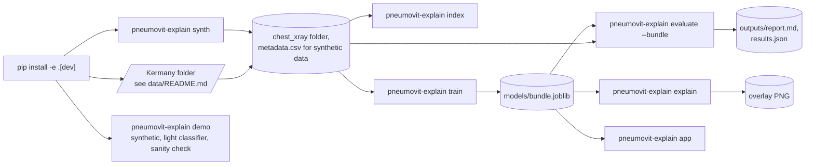

### 10.4 Environment variables

| Variable | Used by | Meaning |
|---|---|---|
| `PNEUMOVIT_DATA_DIR` | index, train, evaluate | Kermany folder |
| `PNEUMOVIT_OUTPUT_DIR` | report | Output folder (default `outputs`) |
| `PNEUMOVIT_MODEL_DIR` | train, app | Bundle folder (default `models`) |
| `PNEUMOVIT_BUNDLE` | app | Bundle path for the app (the `app` command sets it) |
| `PNEUMOVIT_SEED` | all | Random seed (default 42) |
| `PNEUMOVIT_IMAGE_SIZE` | light model, `vit_scratch` | Image side in pixels (default 64) |
| `PNEUMOVIT_VAL_FRACTION` | split | Val share, 0.05 to 0.4 (default 0.15) |
| `PNEUMOVIT_TEST_FRACTION` | split | Test share, 0.05 to 0.4 (default 0.2) |
| `PNEUMOVIT_TARGET_SENSITIVITY` | threshold | Target val sensitivity (default 0.95) |
| `PNEUMOVIT_BOOTSTRAP` | metrics | Bootstrap resamples (default 1000) |
| `PNEUMOVIT_K_NEIGHBOURS` | explain | Neighbours per query (default 10) |
| `PNEUMOVIT_DEVICE` | deep | `auto` (default), `cpu` or `cuda`. `cuda` falls back to `cpu` when CUDA is missing |
| `PNEUMOVIT_LLM_PROVIDER` | summary | `none` (default), `fake`, `gemini` or `openai` |
| `PNEUMOVIT_LLM_MODEL` | summary | Model name (defaults `gemini-2.5-flash`, `gpt-4.1-mini`) |
| `PNEUMOVIT_LLM_BASE_URL` | summary | Base URL of an OpenAI-compatible server |
| `PNEUMOVIT_LLM_SEND_IMAGE` | summary | `true` sends the image to the LLM (default `false`) |
| `GOOGLE_API_KEY` | summary | Key for Gemini |
| `OPENAI_API_KEY` | summary | Key for the OpenAI-compatible API |

Credentials are only in a local `.env` file or the environment. Git ignores `.env`. Do not print or commit credentials.

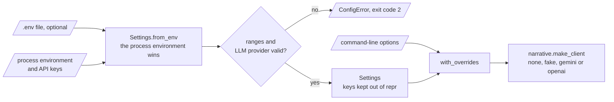

---

## 11. How to extend pneumovit-explain

| You want to… | Do this | Code change? |
|---|---|---|
| Use a local LLM | Set `PNEUMOVIT_LLM_PROVIDER=openai` and `PNEUMOVIT_LLM_BASE_URL=http://localhost:11434/v1` | No |
| Change the target sensitivity | Set `PNEUMOVIT_TARGET_SENSITIVITY` | No |
| Add a timm backbone | Add a name to `TIMM_BACKBONES` in `deep.py` and to `MODELS` in `cli.py` | Small |
| Use FAISS for a large index | Install the extra `faiss` and pass `use_faiss=True` to `TrainIndex` | Small |
| Add Grad-CAM for CNN backbones | Add hooks next to `attention_rollout` in `deep.py` | Yes |
| Validate on an adult dataset | Map the files to the Kermany layout, then run `evaluate --bundle` | No |

---

## 12. Validation results

| Validation | Result | Command |
|---|---|---|
| Unit tests (CI, no torch) | **33 passed, 2 skipped** | `pytest -q` |
| Unit tests (local, with torch) | **35 passed** | `pytest -q` |
| Synthetic demo split | Train 474 images / 192 patients, val 114 / 48, test 156 / 60 | `pneumovit-explain demo` |
| Synthetic demo, light classifier, val | AUC 0.911. Threshold 0.205 gives val sensitivity 0.962, specificity 0.500 | `pneumovit-explain demo` |
| Synthetic demo, test at the operating threshold | AUC 0.891 [0.834, 0.938], sensitivity 0.964 [0.928, 0.991], specificity 0.478 [0.343, 0.600]. 4 missed of 110 | `pneumovit-explain demo` |
| Synthetic demo, test at threshold 0.5 | Sensitivity 0.782, specificity 0.804 | `pneumovit-explain demo` |
| Synthetic demo, calibration | Temperature 0.797, test ECE 0.083, Brier 0.134 | `pneumovit-explain demo` |
| Saliency randomisation check | Mean Spearman -0.193 (max -0.024) over 5 val images | `pneumovit-explain demo` |
| Saliency zone agreement (light classifier) | 0.265 of 68 focal findings (chance 0.167) | `pneumovit-explain demo` |
| Synthetic, `vit_scratch` ablation (local CPU, 64 px, patch 4, width 192, depth 6) | Early stop after 12 epochs, best val AUC 0.568. Test AUC 0.546 [0.464, 0.629], specificity 0.087 at sensitivity 0.964. Zone agreement 0.221 | `pneumovit-explain evaluate --model vit_scratch --epochs 30` |

**What the numbers show.** The val-chosen threshold keeps the test sensitivity near the target, and it costs specificity. The saliency maps depend on the trained model. But the light classifier puts its evidence in the true zone only a little more often than chance, so its saliency map is weak evidence. The from-scratch ViT stays near chance with 474 training images. This result supports a pretrained backbone as the main model.

**What the numbers do not show.** All numbers come from synthetic images. CI does not run the deep classifiers or the public dataset. The prototype reported about 81% test accuracy for the from-scratch ViT (prototype result, not reproduced here).

---

## 13. Known problems

Read these problems before you use pneumovit-explain in production.

| # | Area | Problem | Impact and action |
|---|---|---|---|
| 1 | Data | The public dataset is pediatric (ages 1 to 5) and comes from one centre. | Results do not transfer to adults or other sites. Validate on the target population |
| 2 | CI | CI does not run the deep classifiers or the public dataset. | Public-dataset results are not reproduced in CI. Run `evaluate` locally with a GPU |
| 3 | Explanations | The light classifier finds the true zone in 0.265 of synthetic focal findings. | Treat its saliency map as weak evidence. Use a deep classifier and check its zone agreement |
| 4 | Explanations | The zone agreement needs known finding zones, so it runs on synthetic data only. | On real data, use the randomisation check and expert review |
| 5 | Patients | Patient IDs come from file names. | A renamed file becomes its own patient. Keep the original names |
| 6 | Threshold | A high target sensitivity lowers specificity (0.478 in the demo). | Choose the target with the clinical team. Report both thresholds |
| 7 | Security | `explain` and the app load a `.joblib` file, and joblib can run code on load. | Load only bundles that you made |
| 8 | Privacy | With `PNEUMOVIT_LLM_SEND_IMAGE=true`, the image goes to a third-party API. | Keep the default `false` for any real patient image |
| 9 | Models | The pretrained timm backbones are implemented, but this README gives no measured result for them. | Run `evaluate --model vit_small_dino` on a GPU before you choose a model |
| 10 | Fairness | No metrics per sex, age or site. | Dataset bias can stay hidden. Add subgroup metrics before research use on people |

---

## 14. Key points

1. **The val part chooses, the test part measures.** The test part is read once, after every choice.
2. **The served model is the selected model.** One bundle holds the selected weights, the temperature and the threshold.
3. **Sensitivity comes first.** The threshold targets 0.95 sensitivity on the val part, and the report shows the cost in specificity.
4. **Evidence can disagree with the model.** Neighbours come from both classes, and the summary says so when they disagree.
5. **The LLM never sees the label.** It rewrites facts, and a checker rejects certainty words and new numbers.
6. **This is not a diagnostic device.** A qualified clinician must make every clinical decision.

---

## 15. Glossary

| Term | Meaning |
|---|---|
| **Banner** | The text "NOT A DIAGNOSTIC DEVICE..." at the end of every summary |
| **Bundle** | The saved classifier, temperature, threshold and neighbour index |
| **Deep classifier** | `vit_scratch` or a pretrained timm backbone |
| **Facts** | The measured values that the summary can use |
| **Flag** | "above threshold: review for pneumonia" or "below threshold" |
| **Light classifier** | `light_logreg`: logistic regression on handcrafted X-ray features |
| **Lung zone** | One of six regions: right or left, upper, middle or lower (patient side) |
| **Neighbour index** | The cosine index over embeddings of train-part images of both classes |
| **Operating threshold** | The probability cut-off chosen on the val part for the target sensitivity |
| **Patient** | The person ID from the file name |
| **Probability** | The calibrated pneumonia probability after temperature scaling |
| **Saliency map** | The drop of the pneumonia logit when each patch is blurred |
| **Summary** | The plain-language text from the facts, with the banner at the end |
| **Test part** | The images that the code scores once, at the end |
| **Train part** | The images that fit the model and fill the neighbour index |
| **Val part** | The images that choose the model, the temperature and the threshold |

---

## 16. License

[MIT](LICENSE) © 2026 Krishna Annavaram
